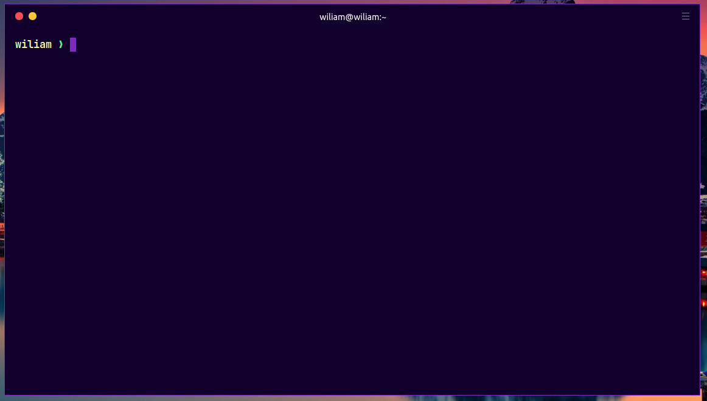

# Theme Dark Purple for [Hyper](https://hyper.is)



## [Install](./INSTALL.md)

#### Install using config file

Clone this repo to `~/.hyper_plugins/local/`

Add `hyper-dark-purple` to the localPlugins list in your `~/.hyper.js` config file.

```sh
    localPlugins: [
    	'hyper-dark-purple'
    ]
```

#### Activating theme

1.  Start Hyper
2.  Go to `View -> Full Reload` or pressing `Cmd + Shft + R`

## License

MIT License
